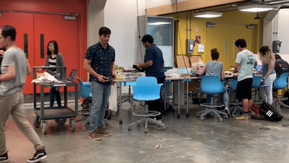
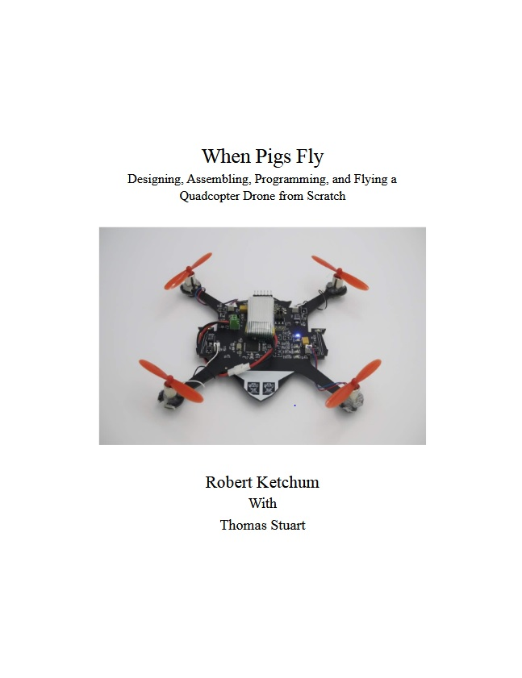
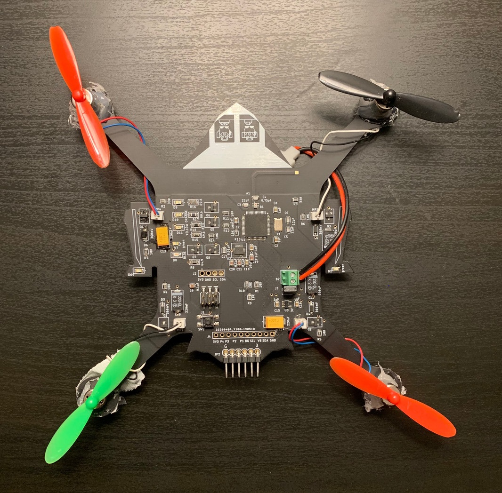
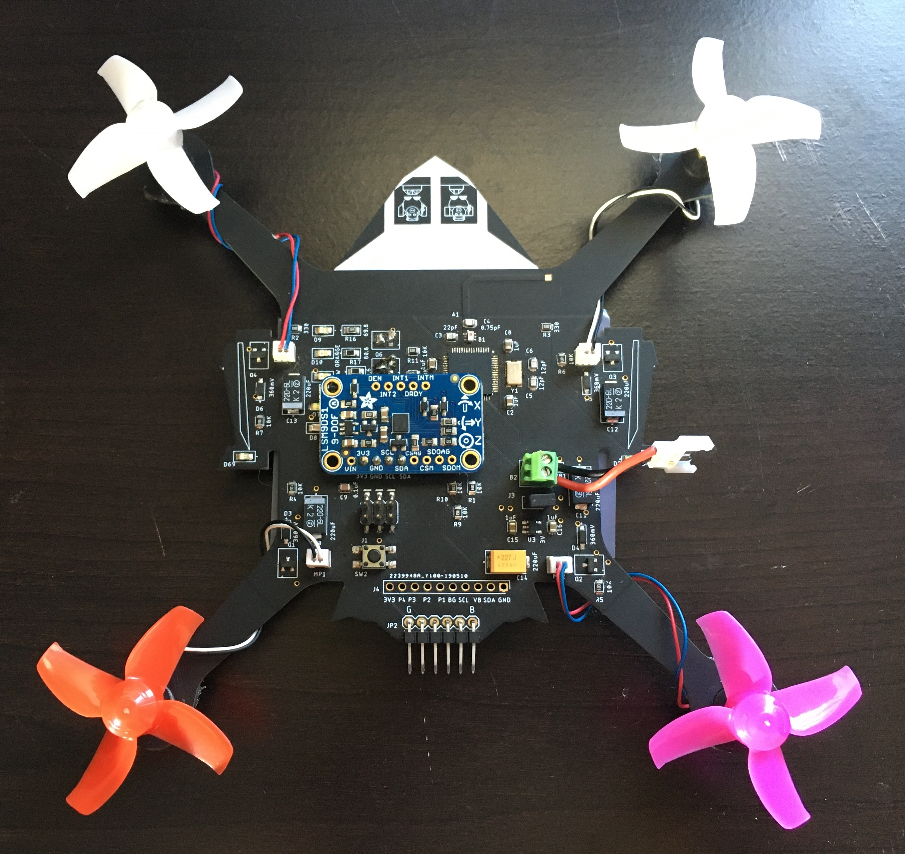
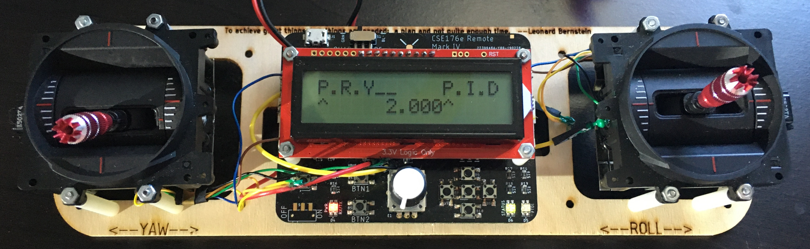
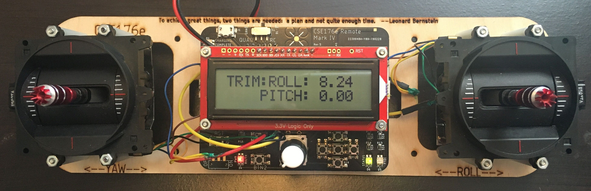
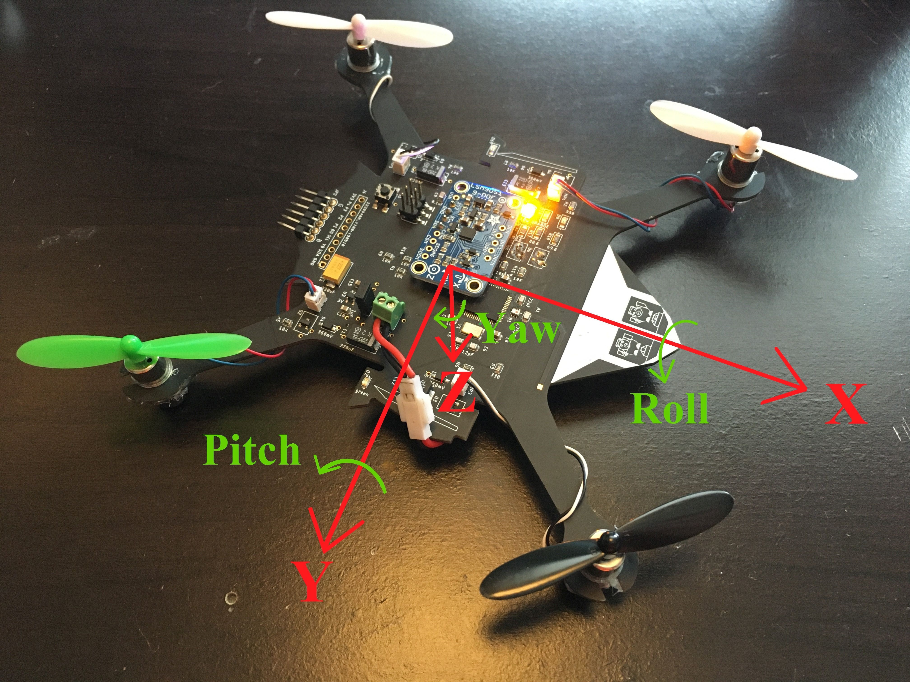

# When Pigs Fly: The Quadcopter Project
The hardware and firmware for a quadcopter were made in the UCSD class CSE 176e: Robotic System Design and Implementation with [@ThomasStuart](https://github.com/ThomasStuart)

## Video of the quadcopter (click on gif)

## Report on the design process

## Various Pictures

Assembled quadcopter

Four bladed propellers with IMU breakout board

Remote PID control system tuning menu

Remote trim tuning menu

Quadcopter orientation angles

