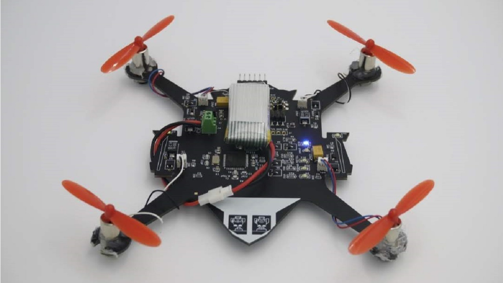

# When Pigs Fly: The Quadcopter Project
The hardware and firmware for a quadcopter were made in the UCSD class CSE 176e: Robotic System Design and Implementation with [@ThomasStuart](https://github.com/ThomasStuart)

## Video of the quadcopter

## Report on the design process

