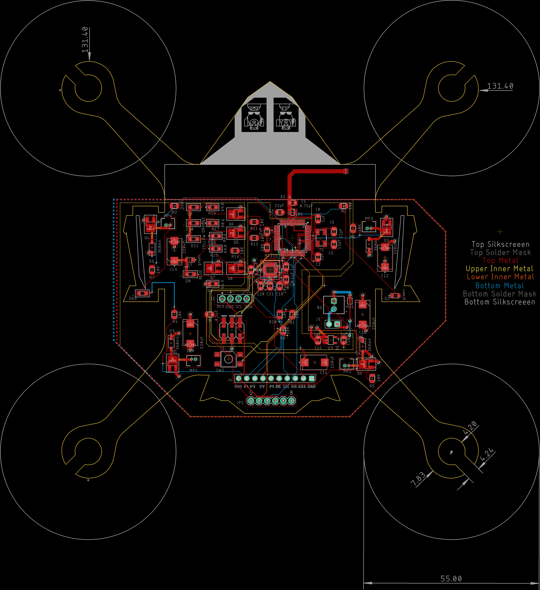

# EAGLE schematic and Board Files
These were updated in version 2.0 to fix wiring issues from the rainbow LED FETs to the microcontroller pins.

Created by  and  with continued updates and revisions by 
Libraries created by .

## Schematic

## Layout

